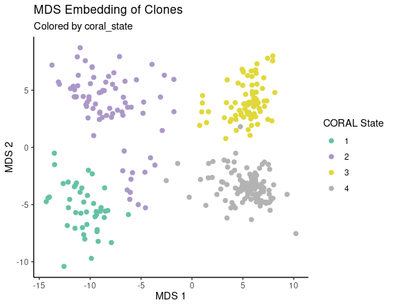
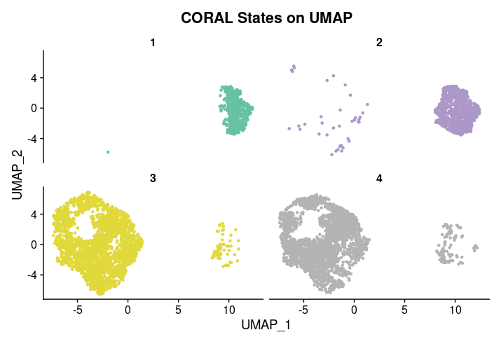
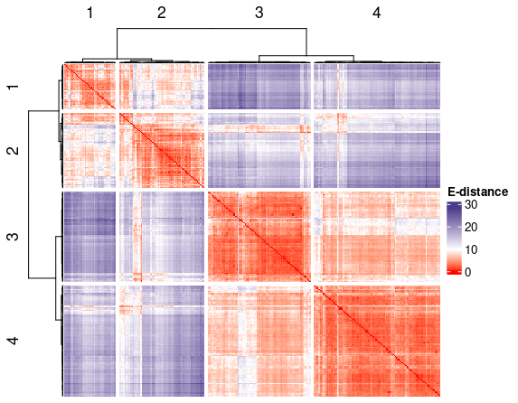
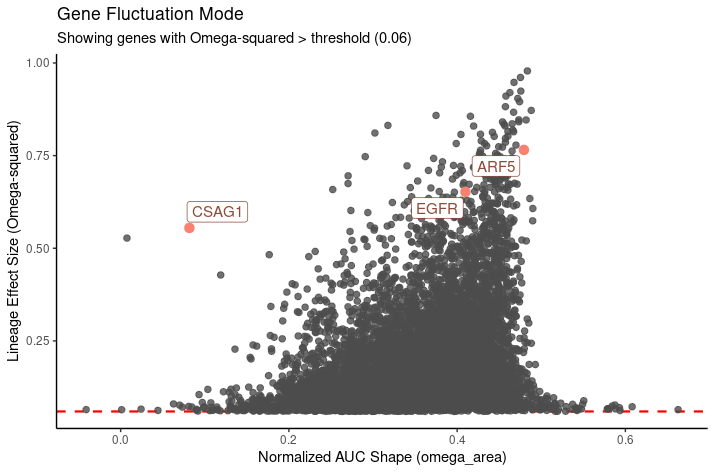
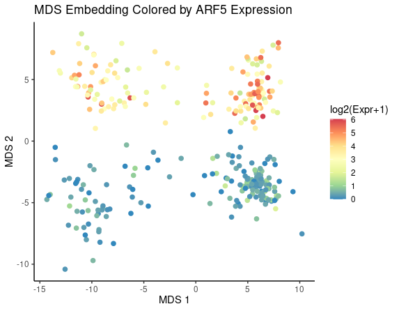
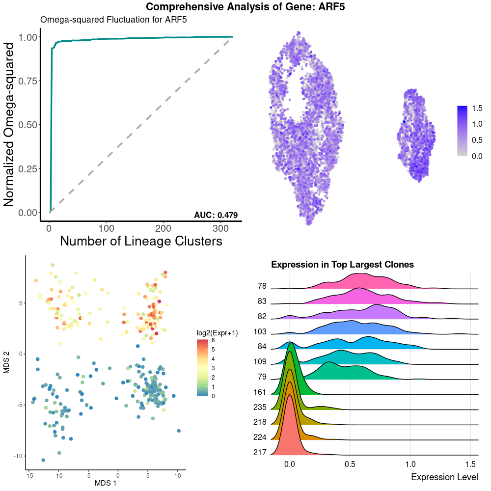

# CORAL

CORAL (Clone Oriented Reconstruction of Attractors in the Landscape) is a project for heritable cell state identification and gene expression dynamics inference, mainly based on the lineage tracing strategy.


## Development and Feedback

We are working to improve CORAL and add new functions. Thus, your feedback and suggestions are very welcome. If you need a new specific function and find something not working, just let us know and we'll fix it. 

Contact: Yongjie Lin (linyjie@pku.edu.cn)


## CORAL-base

**CORAL-base** is the current R version of CORAL, designed for one-timepoint lineage tracing dataset analysis. By integrating lineage information, it provides an alternative way to define the boundary of a truly 'heritable' cell state, rather than a 'cluster'. The resulting 'CORAL'-like cell state tree enables a systematic analysis of 'memory genes' participating in many biological processes.

### Installation

You can install the development version of CORAL-base from GitHub with:

```r
if (!requireNamespace("devtools", quietly = TRUE)) {
    install.packages("devtools")
}
devtools::install_github("YongjieLin1998/CORAL")
```

### Workflow Example

This guide demonstrates the complete `CORAL-base` analysis workflow, assuming you have an existing `Seurat` object.

#### 1. Prerequisites

This tutorial assumes you have already loaded your single-cell data into a `Seurat` object named `seurat_obj`. This object **must contain**:

* Normalized expression data (e.g., processed via `Seurat::NormalizeData()`).
* A metadata column (e.g., `true_clone_id`) that contains the unique lineage barcode or clone identifier for each cell.

* Here we used a published lineage tracing dataset of melanoma cells from [Harmange et.al.2023](https://www.nature.com/articles/s41467-023-41811-8#data-availability)as an example. The dataset is publically available under Gene Expression Omnibus accession number [GSE237228](https://www.ncbi.nlm.nih.gov/geo/query/acc.cgi?acc=GSE237228).

First, load the necessary libraries.

```r
# Load required libraries
library(CORAL)
library(Seurat)
library(ComplexHeatmap)
library(ggplot2)
library(ggpubr)

# This guide assumes `seurat_obj` is already in your environment.
# Let's inspect its metadata to confirm the required columns are present.
# The output should show columns like 'true_clone_id'. 
head(seurat_obj@meta.data)
```

#### 2. Run the Core CORAL Analysis

The `run_coral_ground_truth_analysis()` function is the core of the workflow. It calculates clone distances, defines CORAL states, and identifies heritable genes. All results are conveniently stored within the Seurat object.

```r
# Run the main CORAL analysis pipeline with 6 states
seurat_obj <- run_coral_ground_truth_analysis(
  seurat_obj = seurat_obj,
  true_barcode_col = "true_clone_id", # Specify the clone ID column
  num_states = 6,                      # Group clones into 4 states
  permutation_repeats = 100,           # Recommended repeats for robust results
  n_cores = 4                          # Number of cores for parallel processing
)

# The results are stored in the 'misc' slot of the Seurat object
results_6_states <- seurat_obj@misc$CORAL_ground_truth_analysis
```

#### 3. Iterating and Modifying the Number of States (optional)

A key part of the analysis is exploring the ideal number of states to describe your clonal hierarchy. You can easily test a different number of states by re-running the main analysis function with a new value for `num_states`. This will overwrite the previous results.

```r
# Let's say we want to explore what 4 states look like instead of 6
message("Re-running analysis with 6 states...")
seurat_obj <- run_coral_ground_truth_analysis(
  seurat_obj = seurat_obj,
  true_barcode_col = "true_clone_id",
  num_states = 4, # <-- Changed value
  permutation_repeats = 100,
  n_cores = 4
)

# Now, all downstream visualizations will use the new 4-state grouping.
# For example, let's regenerate the MDS plot with updated states:
p_mds_4_states <- visualize_clone_mds(seurat_obj, color_by = "coral_state")
print(p_mds_4_states)
```

#### 4. Run Advanced Gene Fluctuation Analysis

The `analyze_gene_fluctuation()` function provides deeper insight into the dynamics of heritable genes. It should be run after you have settled on a final number of states.

```r
# Run the gene fluctuation mode analysis on the 6-state result
seurat_obj <- analyze_gene_fluctuation(seurat_obj, n_cores = 4)

# The results are updated in the heritable_genes_df with a new 'omega_area' column
print("Heritable genes dataframe with omega_area:")
head(seurat_obj@misc$CORAL_ground_truth_analysis$heritable_genes_df)
```

#### 5. Visualize the Final Results

CORAL-base provides a suite of plotting functions to explore the final analysis output. Meanwhile, you can simply use Seurat-based visualization functions to highlight the CORAL states in traditional embedding methods like UMAP. 

##### Visualizing CORAL States on the MDS clone Plot and UMAP cell Plot
A core visualization is to view the relationships between clones in a 2D space using MDS. The `visualize_clone_mds` function can then color each clone by its assigned CORAL state, revealing the structure of the clonal hierarchy.

```r
# Visualize the MDS embedding of clones, colored by their assigned CORAL state.
# The function uses `color_by = "coral_state"` by default.
p_mds_by_state <- visualize_clone_mds(seurat_obj)
print(p_mds_by_state)
```



The `visualize_coral_states_split_umap` function can then color each clone by its assigned CORAL state in the original UMAP visualization in Seurat object. It shows that the cell states divided by CORAL can be highly overlapped in traditional embedding methods.

```r
# Visualize the UMAP embedding of clones, colored by their assigned CORAL state.
my_split_umap <- visualize_coral_states_split_umap(seurat_obj, ncol = 2, pt.size = 0.8)
```



##### Clone Energy Distance Heatmap
This heatmap displays the transcriptional similarity between all clones. The clustering reveals clone groupings, which are now partitioned into 4 CORAL states.

```r
# Visualize the clone-clone energy distance matrix with 4 states  
ht <- visualize_clone_distance_heatmap(seurat_obj)
ComplexHeatmap::draw(ht)
```



##### Confusion Matrix: CORAL States vs. Metadata
This heatmap shows the correspondence between our 6 lineage-defined CORAL states and any other pre-existing cell annotation, such as cell type.

```r
# Create a confusion matrix heatmap
# Assumes a 'cell_type' column exists in your metadata
p_confusion <- plot_state_celltype_confusion(
  seurat_obj,
  celltype_col = "startID"
)
ComplexHeatmap::draw(p_confusion)
```


##### Heritable Gene Distribution
This plot is a key diagnostic tool that compares the observed distribution of Omega-squared values (heritability effect size) against the null distribution from permutations.

```r
# Compare the observed vs. null distribution of Omega-squared
p_dist <- plot_heritable_gene_distribution(seurat_obj)
print(p_dist)
```


##### Gene Fluctuation Mode Plot
This plot visualizes the relationship between a gene's heritability effect size (Omega-squared) and its fluctuation pattern (`omega_area`), revealing genes with distinct modes of inheritance.

```r
# Visualize the gene fluctuation mode
p_fluctuation <- plot_gene_fluctuation_mode(
  seurat_obj,
  genes_to_highlight = c("EGFR", "ARF5", "CSAG1") # Highlight genes of interest
)
print(p_fluctuation)
```



#### Visualizing Gene Expression on the MDS Plot
This function colors the MDS clone projection by the pseudobulk expression of a specific gene, providing an intuitive view of a gene's expression across different CORAL states.

```r
# Find a top heritable gene to visualize
heritable_genes_df <- seurat_obj@misc$CORAL_ground_truth_analysis$heritable_genes_df
top_gene <- heritable_genes_df[which.max(heritable_genes_df$Omega_square), "name"]

# Now, visualize its expression on the MDS plot with a simplified call
p_gene_mds <- visualize_gene_mds(
  seurat_obj,
  gene = top_gene
)
print(p_gene_mds)
```



#### Plotting a Gene's Omega-squared Fluctuation Curve
This function plots how a specific gene's Omega-squared value changes as the clone clustering hierarchy is traversed, revealing the gene's heritability structure.

```r
# Plot the fluctuation curve for the same top heritable gene
p_omega_curve <- plot_gene_omega_curve(seurat_obj, gene = top_gene)
print(p_omega_curve)
```


#### Creating a Comprehensive Gene Dashboard
This powerful function combines multiple key visualizations for a single gene (fluctuation curve, UMAP feature plot, MDS expression plot, and ridge plot) into a single dashboard, offering a holistic view of its heritability and expression patterns.

```r
p_dashboard <- plot_gene_dashboard(
  seurat_obj,
  gene = top_gene
)
print(p_dashboard)
```



---

## Citation

If you use CORAL in your research, please cite:

Lin, Y., Chen, X., Wu, L., Zhou, Y., & Lin, Y. (2025). Widespread transcriptional memory shapes heritable states and functional heterogeneity in cancer and stem cells. *bioRxiv*, 2025-08.

The original codes and example datasets of the [initial manuscript](https://www.biorxiv.org/content/10.1101/2025.08.21.671653v1.full) are available in this [Google Drive folder](https://drive.google.com/drive/folders/1-cNiSKZFyVSs9Mndq87AcRXfaGweLesj?usp=sharing).

We noted that the original codes can be much slower than the current version. 

---

### Development Tools

This project leverages modern development tools to ensure code quality and consistency. Generative AI (such as GitHub Copilot) is used as an assistant for tasks including:

* **Code Formatting**: Ensuring a consistent style across the codebase.
* **Comment Generation**: Improving code readability and documentation.
* **Proofreading**: Refining documentation and text within the project.

All critical logic and architectural decisions are developer-led and reviewed.
